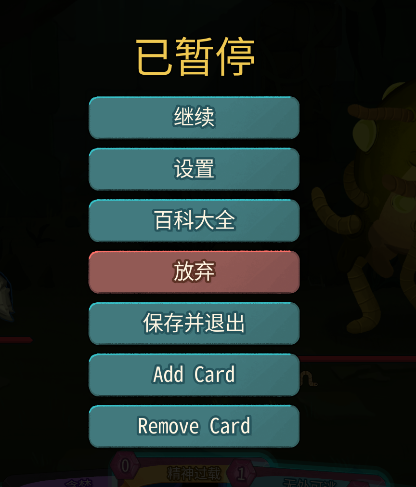
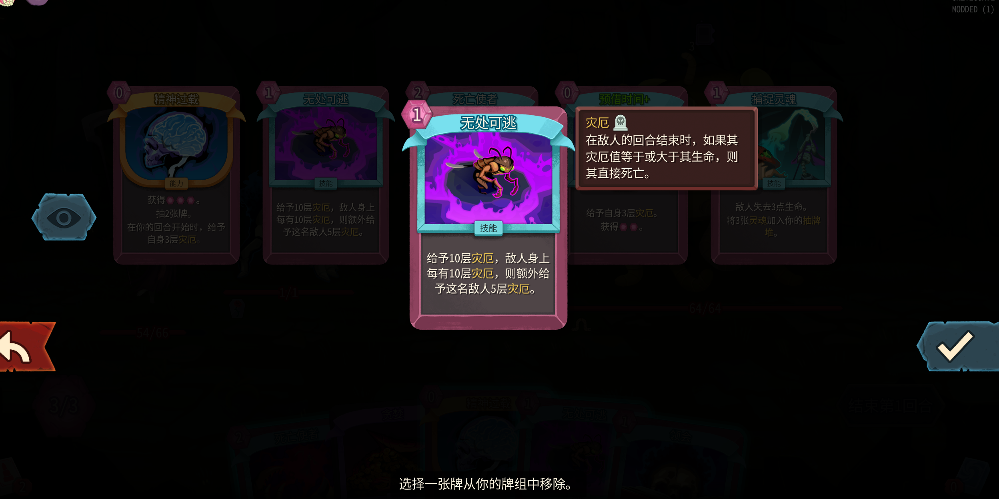

# STS2SelectCard

`STS2SelectCard` 是一个《杀戮尖塔 2》Mod，会在暂停菜单中加入两个功能按钮：

- `Add Card`：打开当前角色的卡牌选择界面，并将选中的卡直接加入牌组
- `Remove Card`：调用游戏原生的删卡流程，而不是直接硬改牌组

这个仓库已经包含编译好的可用文件。普通玩家不需要关心源码，也不需要自己编译。

## 快速开始

### 直接复制发布包

1. 打开发布目录：`release/STS2SelectCard`
2. 将整个 `STS2SelectCard` 文件夹复制到游戏目录下的 `Slay the Spire 2/mods/`
3. 确认复制后的目录结构如下：

```text
Slay the Spire 2/
└─ mods/
   └─ STS2SelectCard/
      ├─ STS2SelectCard.dll
      └─ STS2SelectCard.json
```

4. 启动带 Mod 的游戏
5. 进入一局游戏后，打开暂停菜单，即可看到：
   - `Add Card`
   - `Remove Card`

也可以直接使用压缩包：

- [release/STS2SelectCard-v1.1.zip](./release/STS2SelectCard-v1.1.zip)

解压后同样把 `STS2SelectCard` 文件夹复制到 `Slay the Spire 2/mods/` 即可。

### 暂停菜单效果

安装成功后，暂停菜单会出现两个新按钮：



### 原生删卡界面

`Remove Card` 使用的是游戏原生删卡流程，安全性比直接改牌组更高：



## 注意事项

- 普通玩家只需要复制编译好的文件，不需要安装 .NET，不需要打开 Godot，也不需要自己编译源码。
- 本 Mod 是 DLL-only 形式，`STS2SelectCard.json` 中的 `has_pck` 为 `false`。
- `Remove Card` 现在走的是游戏原生删卡逻辑：
  - 商店内优先走商店删卡流程
  - 其它场景走奖励删卡流程
- 游戏在检测到 Mod 后，通常会使用独立的 `modded` 存档目录；如果你发现原版存档不见了，一般不是丢档，而是切到了另一套存档。
- 如果你替换了新的 DLL，但游戏里还是旧效果，通常是因为游戏进程还没退出，Windows 锁住了 DLL 文件。

## 故障排查

- 按钮出现了，但点击没有反应：
  先确认 `Slay the Spire 2/mods/STS2SelectCard/` 下面的 `STS2SelectCard.dll` 和 `STS2SelectCard.json` 是最新版本。
- 带 Mod 启动后存档像没了一样：
  先检查是否切到了 `modded` 存档目录。
- 替换 DLL 后游戏行为没变化：
  完全退出游戏，再重新复制 DLL 后启动。

## 仓库内容

- [release/STS2SelectCard-v1.1.zip](./release/STS2SelectCard-v1.1.zip)：可直接发给玩家使用的压缩包
- [release/STS2SelectCard/STS2SelectCard.dll](./release/STS2SelectCard/STS2SelectCard.dll)：编译好的 DLL
- [release/STS2SelectCard/STS2SelectCard.json](./release/STS2SelectCard/STS2SelectCard.json)：Mod manifest

## 给开发者

如果你只是玩家，到这里就够了，可以忽略源码部分。  
如果你需要继续开发，源码入口在：

- [Scripts/Entry.cs](./Scripts/Entry.cs)
